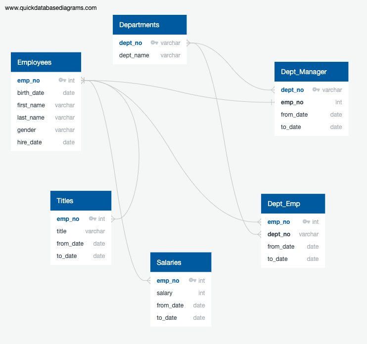
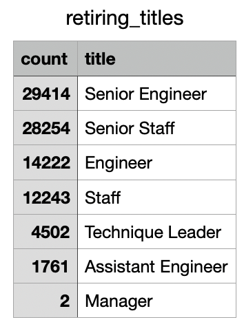
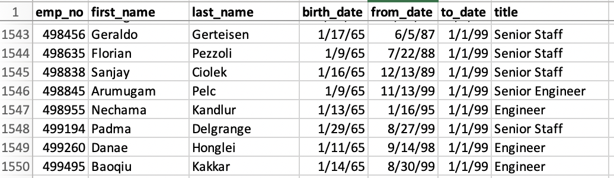
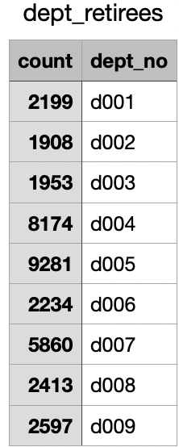
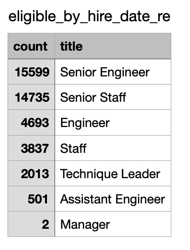
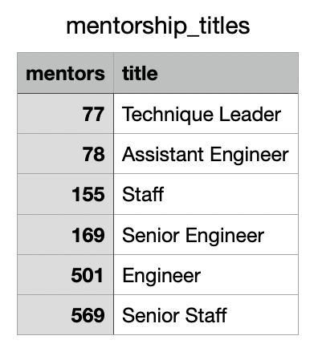

# Pewlett-Hackard-Analysis

Utilized PostgreSQL and PGAdmin to import six CSV files and create several SQL queries and tables to analyze Pewlett-Hackard employee data in regard to upcoming retirement eligibility.  

# Overview of the analysis:

The purpose of this analysis was to assist upper management at Pewlett-Hackard in "future-proofing" the Company by deteriming the number of current employees eligible for the Company's retirement package by both department and job title, as well as determining the number of (and job title of) employees eligible to participate in a mentorship program with new employees as an alternative to the Company's retirement package. 

Below is an image of the schema that was used in importing the six provided CSV files as tables into a PostgreSQL database in order to perform queries on the data and provide the deliverables described above. 

# Results:

The images below include tables for the first two deliverables of the module challenge, which consisted of finding the number of retirement-eligible employees at Pewlett-Hackard (by title) as well as the number of mentorship-eligible employees. From the tables, we can draw the following conclusions: 

- There are 90,398 current employees potentially eligible for retirement (based on D.O.B) at Pewlett-Hackard 
- The vast majority of potentially eligible employees hold the title of Senior Engineer or Senior Staff, followed by Engineer and Staff  
- There are 1,550 mentorship-eligible employees at Pewlett-Hackard 
- There are only two management positions potentially opening up at Pewlett-Hackard 

| Number of Retirement-Eligible Employees by Title | Mentorship-eligible Employees | 
:-------------------------:|:-------------------------:
 | 

# Summary:

Upon examining the number of retirement-eligible employees by department (in the table below), which includes a total of 36,619 employees, it seemed strange that it reflected less than half the number of retirement-eligible employees by title. It became apparent that the Deliverable One table ("Number of Retirement-Eligible Employees by Title) did not include any filter for retirement eligibility based on hire-date, but rather filtered only by date of birth. Upon adding a hire-date eligibility query, I created a new table reflecting truly retirement-eligible employees by title, as displayed below. 

| Number of Retirement-Eligible Employees by Department | Number of Truly Retirement-Eligible Employees By Title | Mentorship-eligible Employees by Title 
:----------------------------:|:---------------------------:|:--------------------:
 |  |

In this new table, there are 41,380 employees under seven separate titles at Pewlett-Hackard eligible to accept the retirment package. This is still a rather large number of new employees to be training given that only 1,550 employees are eligible to become mentors to the new employees. With no regard for title, that would place each mentor with approximately 27 trainees, which seems a bit high for effective mentorship. Pewlett-Hackard may wish to consider expanding the eligibility requirements for its mentorship program. There is also the mentor's current title at the company to consider, as it would make sense that a mentor train new hires within their most recent role. While there are the most retirement-eligible employees in the roles of Senior Engineer and Senior Staff, there are the most mentorship-eligible employees in the roles of Engineer and Senior Staff, leaving the role of Senior Engineer particular susceptible to a shortage of mentors given the current parameters. 

In creating these deliverables to assist in future-proofing Pewlett-Hackard, it seemed strange that none of the employees at Pewlett-Hackard had ever received a raise. Upon examining the "salaries" table in the "PHEmployeesDB" database in PGAdmin, the total number of employee numbers in the "salaries" table (SELECT COUNT (emp_no) FROM salaries) was the same as the number of unique employee numbers (SELECT COUNT(DISTINCT(emp_no)) FROM salaries), which confirmed that no employee had ever received a raise. Upon further inspection of the "to date" and "from date" columns of the "salary" table, employee tenure approximated a one-year period, suggesting the "salaries" table only reflects the salary an employee received upon hire, and does not reflect their new salary after a raise or perhaps after their probationary period. If Pewlett-Hackard requires any further anaylses involving employee salary, a more complete data set would be necessary. 
